# Prioritizing Channels

The following document describes early results for dynamically setting the number of segments used in each channel of a flat envelope index.

## Goal

Assuming that we can not use more than a fixed number $N_s^\text{total}$ of segments in total for our index, it can make sense to not distribute these segments evenly across channels, but instead give more segments to difficult channels. To confirm this hypothesis, experiments were run on the stocks dataset, with flat envelope index with optimal settings for $N_l$ (number of length groups) and $N_p$ (number of position groups i.e. envelopes per time series), with varying $N_s^\text{total}=5N_s^\text{avg}$ (there are 5 channels). Stocks were chosen for this purpose, as one of the channels (*fifth*) differs greatly from the rest and univariate queries on said channel have also been found to be significantly slower and have lower pruning power:

| Example from the stocks dataset | Performance of univariate queries on stocks |
|:-:|:-:|
| 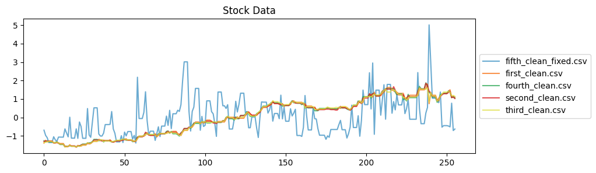 | 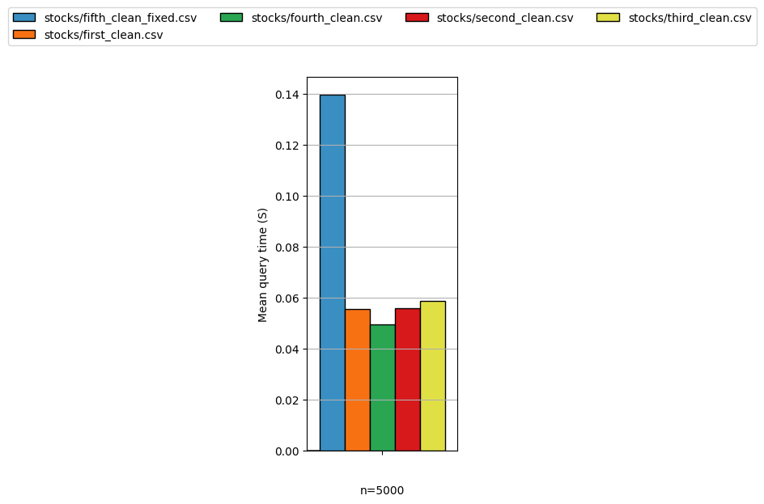 |

For each value of $N_s^\text{total}$ three channel segmentation strategies (CHSSs) were tested:
1. **Multi 40-15**: Give $40\%$ of the segments to *fifth* and $15\%$ to each of the other channels
2. **Multi 60-10**: Give $60\%$ of the segments to *fifth* and $10\%$ to each of the other channels
3. **Single**: distribute the segments evenly across channels (i.e. use a single segmentation strategy)

| $N_s^\text{total}=20$ | $N_s^\text{total}=40$ | $N_s^\text{total}=60$ | $N_s^\text{total}=80$ |
|:-:|:-:|:-:|:-:|
| 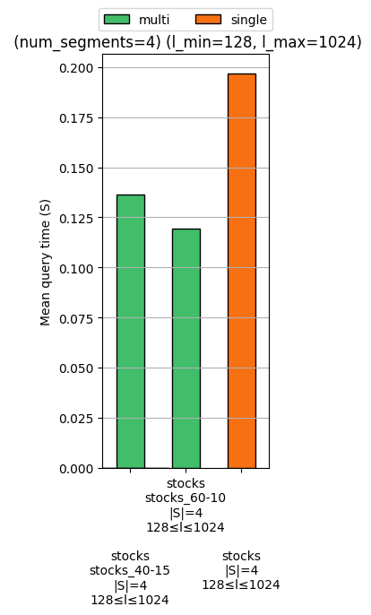 | 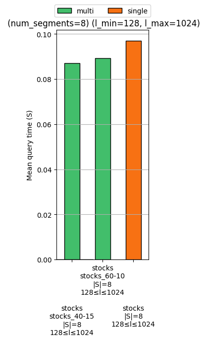 | 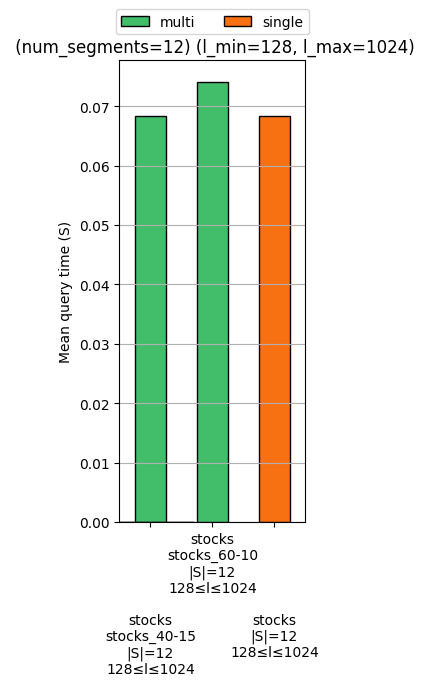 | 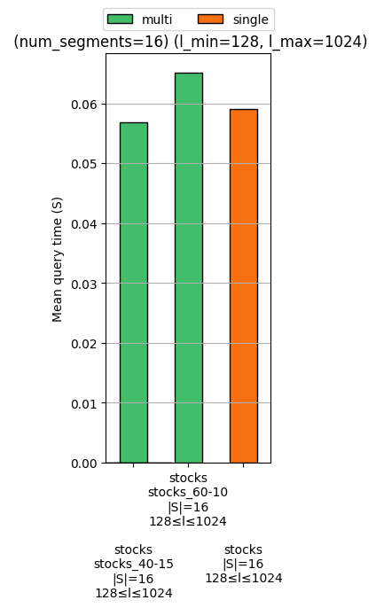 |

### Observations:

- If the number of segments available is very limited, using a large portion of them for the "important" *fifth* channel **greatly improves performance**. Based on this, channel prioritization seems like a worthwhile pursuit.
- With more segments available, prioritizing the *fifth* channel gives diminishing returns, and performance can be worse than with even segment distribution

## Approach

We wish to estimate the difficulty of each channel:
- Run-time is highly correlated with pruning ratio (in flat envelope indexes)
- Pruning ratio is driven by the properties of envelopes:
    1. We want envelopes to be **tight** (upper and lower bounds of envelope segments close to each other on average)
    2. We want envelopes to be **easily differentiable** from one another
- **Idea**: we may look at some **sample envelopes** or **bands (envelopes with segment length $1$)** to figure out how envelopes of the entire index will behave. To measure the aforementioned properties:
    1. Look at the average of segment ranges ($\text{upper}-\text{lower}$)
    2. Look at standard deviation of envelope properties across the sample (e.g. mean and std of envelope segment $\text{lower}$, $\text{upper}$, $\text{mid}$ points in each envelope)

### Attempt 1: Regression

**Idea**: We can try various regression models for predicting the run-time or pruning-power of the optimal index on univariate queries, based on envelope / band statistics on a dataset sample. To avoid learning correlations between channels, we can evaluate using cross-validation per dataset (e.g. predict stocks using a model trained on synthetic and weather data).

**Result**: The regression task proved to difficult - both run-time and pruning-power can vary greatly between different samples of the same channel, and correlation with envelope / band statistics is low. As a result most model collapse to simply predicting the mean.

### Attempt 2: Look more closely at the data

To see how useful the provided statistics are, we can look at the principal components:
```
Principal Component 1: 0.9675
Principal Component 2: 0.0183
Principal Component 3: 0.0129
Principal Component 4: 0.0012
Principal Component 5: 0.0002
Principal Component 6: 0.0000
Principal Component 7: 0.0000
....
```
Regardless of the statistics chosen, the first two principal components explain $97\%-98\%$ of the variance in the data, therefore using only two statistics should be sufficient. We can visualize the samples for each dataset - in the following plots, for each point:
- The pruning ratio has been calculated by running the univariate index with optimal parameters on the given channel for 50 queries
- The index statistics have been calculated by taking a $1\%$ sample of the dataset of the index, and measuring the statistics of the bands ($N_s=m,N_l=1,N_p=1$) created for that sample. Each dataset contains $n=1000$ time series, so the samples consist of $10$ time series.
- Outliers have (the lower and upper 0.001 percentile on by both statistics) been discarded - this resulted in 3 points being discarded from stocks and 2 from weather. For stocks, this was necessary to clearly see clustering.
- For synthetic data each channel uses different Gaussian standard deviation for the steps in the random walk process

| Synthetic | Stocks | Weather |
|:-:|:-:|:-:|
| 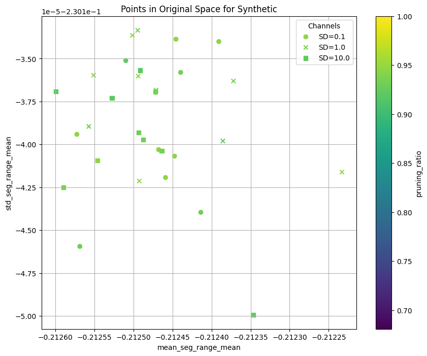 | 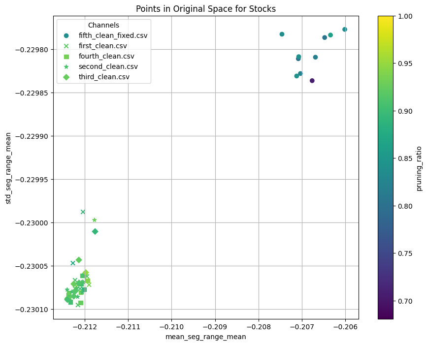 | 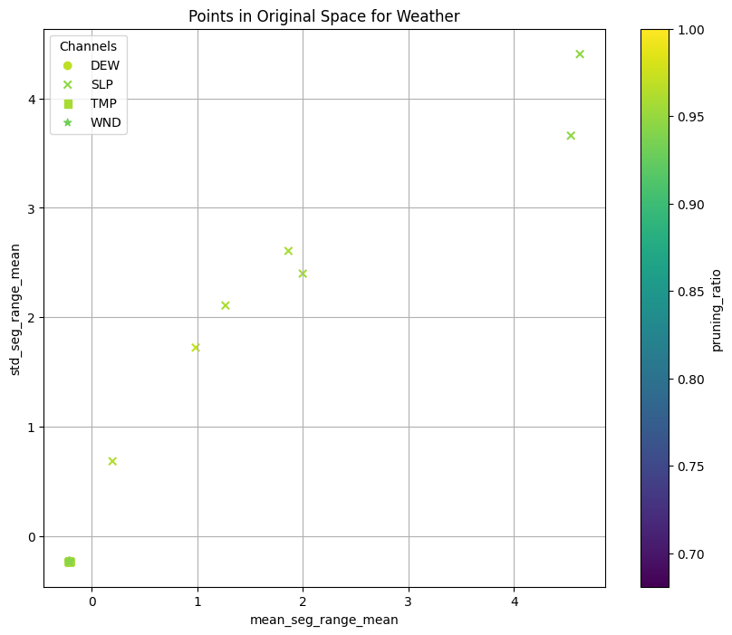 |
| 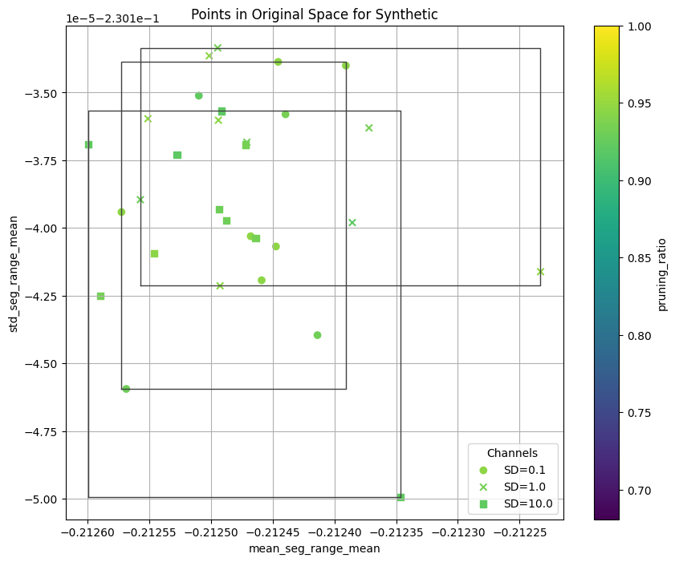 | 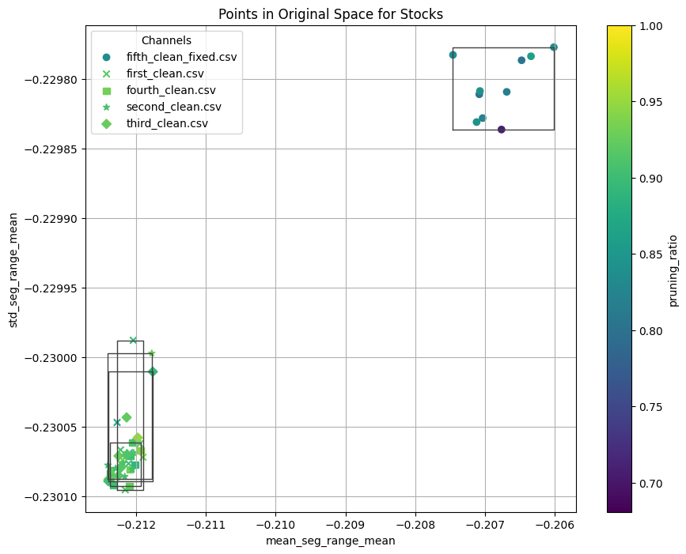 | 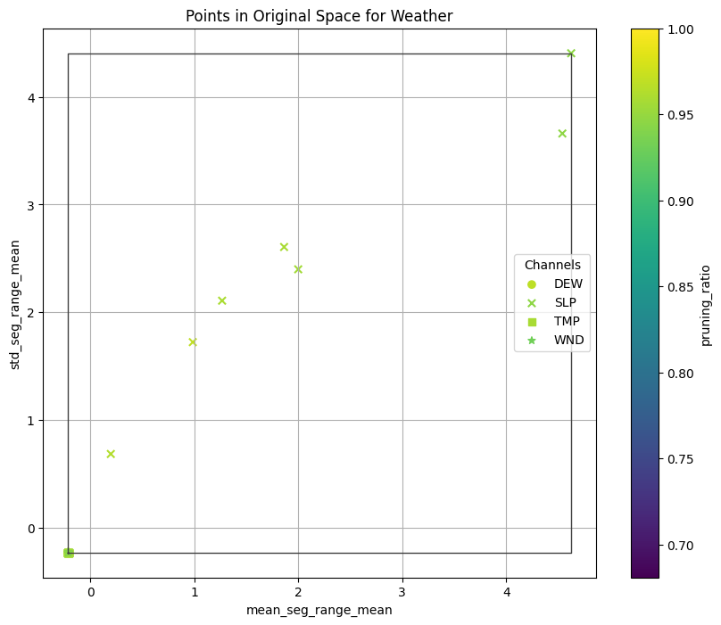 |

#### Observations and Questions

- On synthetic data, where each channel is equally important (these vary only in the step size, which has previously been shown to be irrelevant for normalized queries), the channel "boxes" overlap. This could be used to distribute segments evenly.
- On stocks data, the important *fifth* channel forms a clearly distinct cluster from the rest. We can also see that the pruning ratio of the *fifth* channel is significantly lower
- On the weather dataset, the SLP channel shows strange behavior, with points varying on a much larger scale than those of other channels. Depending on the statistics used, the box of the SLP channel may not overlap with other channels. However, it's pruning power or run-time are not significantly different than that of the rest of the channels (\*), so it should not be treated differently. This raises two questions:
    1. Why does this happen?
        - The main characteristic I can see on SLP is that it is more smooth than the rest of the channels, and maybe it is more cyclic?
    2. How can it be dealt with?
        - We may look at the distance of points within the same channel, as well as the distance to other channel points.
        - Find more robust statistics
        - Test higher sample sizes

For reference:

| Examples from Weather | (\*) Performance on univariate queries on Weather |
|:-:|:-:|
| 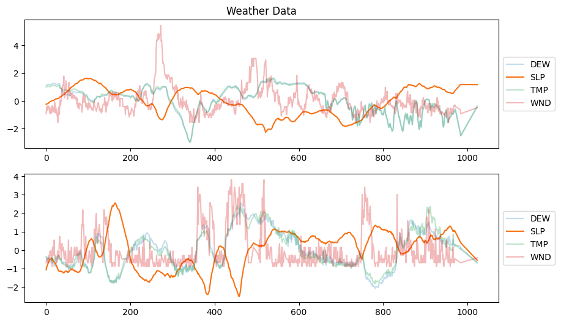 | 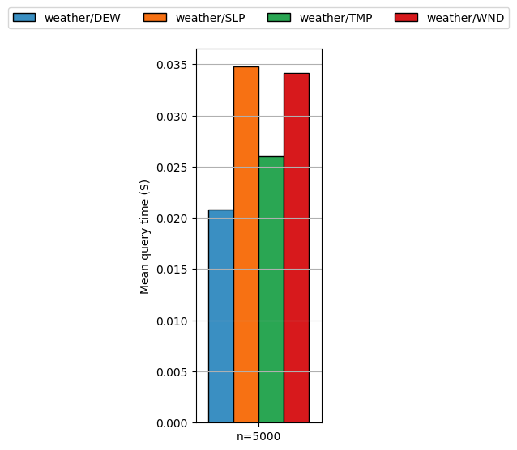 |

