# Parametrization results

## Parameters

Envelope-based indexes share the following three parameters:
- $N_l$: The number of length groups, a separate index is created for each length group, and at query time only the relevant index is used. The number of lengths per length group ($\beta$) determines $N_l$:
    - $N_l:=\left\lceil (l_{\max} - l_{\min} + 1) / \beta  \right\rceil$
- $N_p$: The number of position groups, i.e. the **number of envelopes per time series**. Each envelope is a separate entity in the index. The number of starting positions per envelope ($\gamma$ in the ULISSE paper) determines $N_p$:
    - $N_p:=\left\lceil (m-l_{\min}+1) / \gamma \right\rceil$
- $N_s$: The number of segments for $l_{\max}$ long envelope. For these experiments uniform-length segments were used, as attempts at dynamically varying the length of segments revealed no benefit over using uniform-length segments $[1]$. Therefore, the segment length ($s$) determines $N_s$:
    - $N_s:=\left\lfloor l_{\max} / s \right\rfloor$

## Setup

Flat-envelope indexes were found to outperform both iSAX+envelope and pure iSAX indexes $[2]$, therefore parametrization was done on flat-envelope indexes, on sub-samples of 10 univariate datasets, with 1000 time series of length 1024, with three possible query ranges: $\text{range}_{|Q|}\in\{[128, 1024], [128, 768], [512, 1024]\}$, and $100$ queries per configuration.

|  | | Values |
| - | - | - |
| **Datasets** | | synthetic, 4 weather datasets, 5 stocks datasets |
| **Query ranges** | | $[128, 1024]$, $[128, 768]$, $[512, 1024]$ |
| **No. series** | $n$ | $1000$ |
| **Series length** | $m$ | $1024$ | 
| **No. channels** | $\|C\|$ | $1$ |
| **No. queries** | $N_q$ | $100$ |

Parametrization was done in the following stages:
1. Run *low resolution* grid search with all three parameters to determine bulpark / starting point
2. Run *high resolution* search for one parameter at a time, keeping the others fixed at the best-so-far value. The order of high resolution searches is $N_l$, $N_p$, $N_s$

## Results

### Low Resolution Grid Search

Across all dataset - query-range combinations:
- $N_l$: more length groups always lead to faster query time, but slower indexation and especially larger indexes
- $N_p=10$ leads to the lowest query time in all cases
- $N_s=32$ leads to the lowest query time in all cases

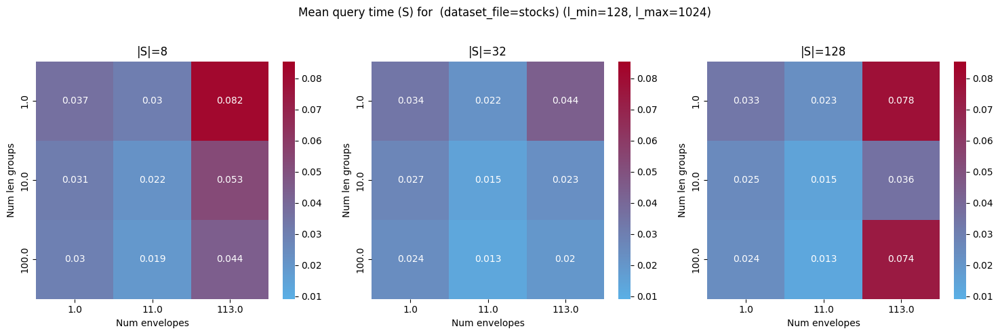

Differences for smaller query ranges are less pronounced, but the same parametrization is still optimal:

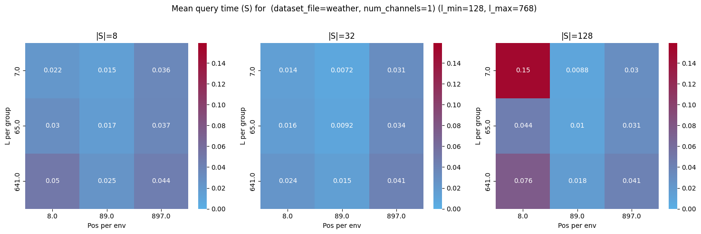

### No. Length Groups $N_l$

$N_l$: More length groups $\Rightarrow$ faster queries, but returns are diminishing, $N_l\approx20$ is not much slower (around $10-15\%$ slower) than $N_l\approx400$.

| | | |
|-|-|-|
| 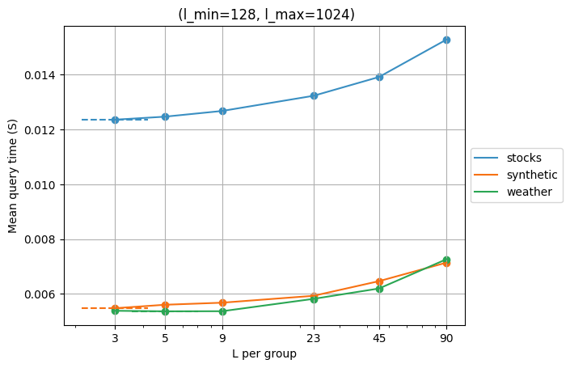 | 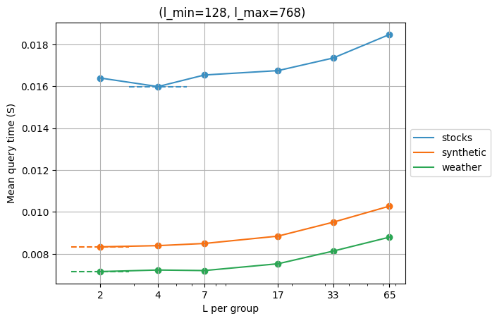 | 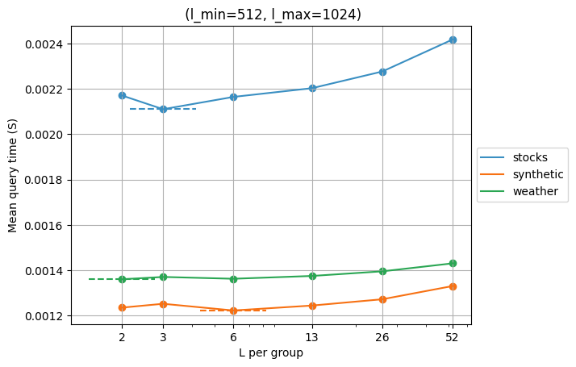 |

### No. Position Groups $N_p$

$N_p$: Larger query ranges prefer more positions groups: $N_p\approx 20$, while shorter ranges work best with $N_p\approx 8$. Default values should be biased towards the long query range case as these are slower with envelope-based indexes $[3]$, so $N_p=16$ is reasonable default.

| | | |
|-|-|-|
| 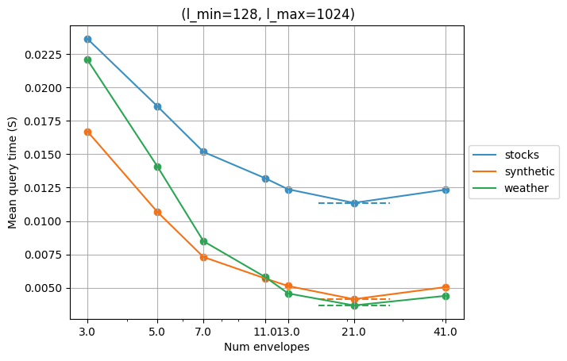 | 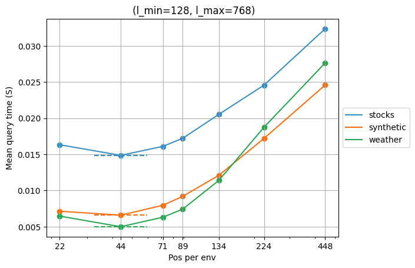 | 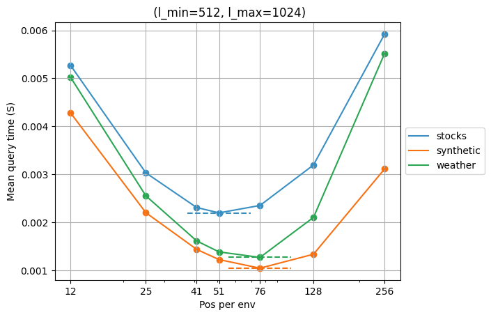 |

### No. Segments $N_s$

$N_s$: Larger query ranges prefer more segments, $N_s\approx36$, while shorter ranges work best with $N_s\approx20$. However, for both cases, the range of $N_s$ values that lead to close to optimal query time is quite wide. $N_s=32$ is good default for all cases.

| | | |
|-|-|-|
| 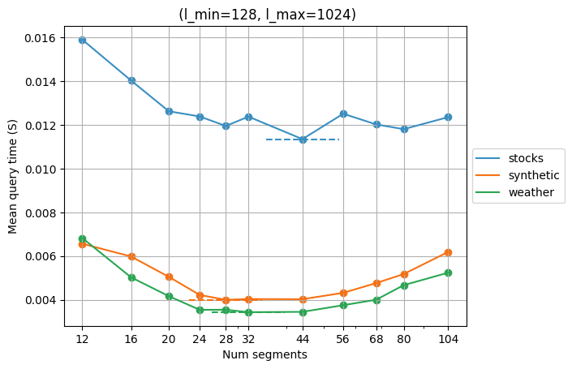 | 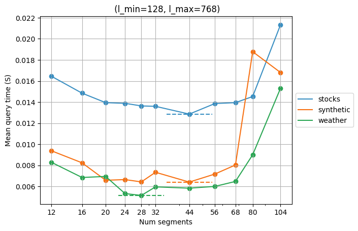 | 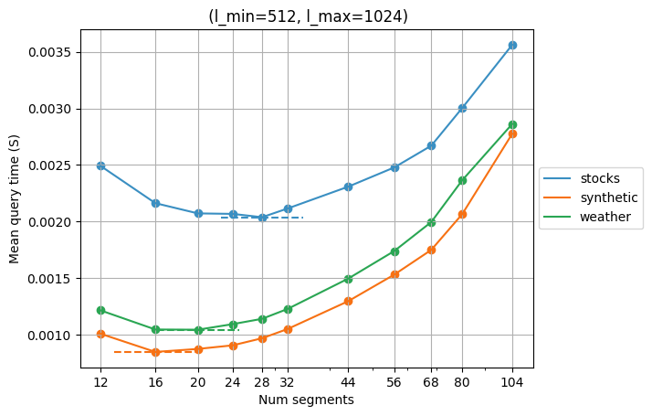 |

## Multivariate case

The first stage (low-resolution grid search) was repeated for multivariate data with the following datasets:
- Weather data with 4 channels
- Stocks data with 5 channels
- Synthetic data with 4 channels
- Synthetic data with 10 channels

The results are very similar to the univariate case:

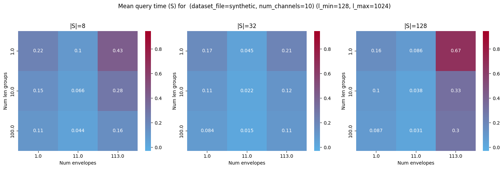

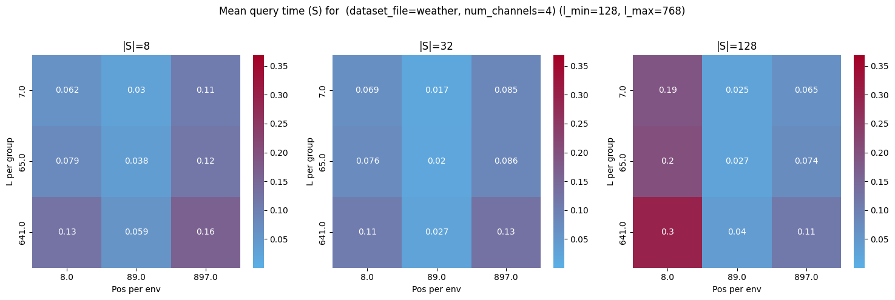

## Effect of dataset size and series length

TODO
- [ ] Dataset size: scales linearly
- [ ] Series length: scaling is not linear, low resolution search shows similar optimal values for $N_l$ and $N_s$, however larger $N_p$ works better with longer time series. The difference is not large and $N_p\approx 32$ tends to work well across the board. Approximating the optimal value by linearly scaling between the optimal values found at different values of $m$ can also work.

___
### Experiments to include:

- $[1]$: Comparison of segmentation methods
- $[2]$: General comparison of flat-envelope, iSAX-envelope, pure iSAX
- $[3]$: Experiment comparing long and short query ranges
